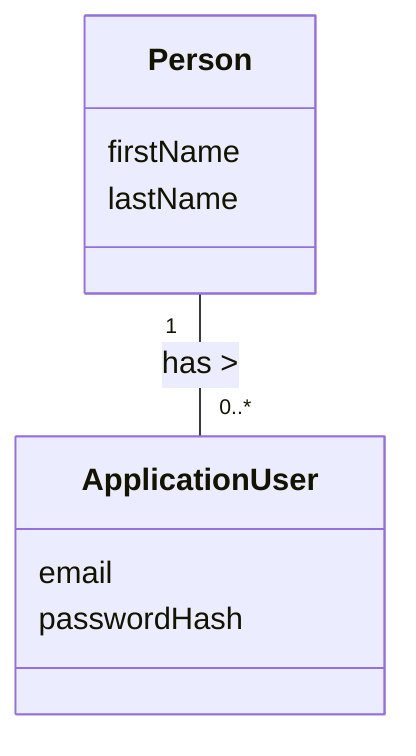

# Domain Model – UC-001: Simple Login

## Metadata
| **ID** | **Description** | Cross Reference links |
|--------|-----------------|-----------------------|
| UC-001-DM | Domain Model for Application User Authentication Use Case | [UC-001](../UC-001/README.md) |

## Version
**Version:** 1.0  
**Reviewed/Approved:** 2026-01-20

## Version Log
| **Version** | **Date**       | **Author**      | **Change Description**                      |  
|-------------|----------------|-----------------|---------------------------------------------|
| 1.0         | 2026-01-20     | TirsvadCLI      | Initial version of the domain model         |

---

## Diagram

<!-- Links -->
[UC-001]: ../UC-001/README.md "Use Case UC-001: Application user authentication"
[UC-001-UserStories]: ../UC-001/UserStories.md "User Stories for UC-001"
