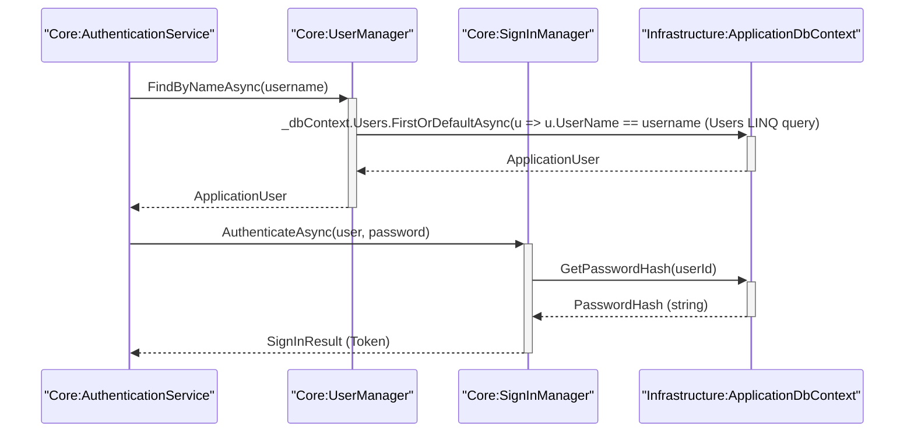

# Sequence Diagram (SD)

## Metadata
| **ID**      | **Description**                                                        | Cross Reference links                       |
|-------------|------------------------------------------------------------------------|---------------------------------------------|
| UC-001-SD   | Sequence Diagram for Application user authentication use case          | [UC-001](../UC-001/README.md)               |

## Version
**Version:** 1.0  
**Reviewed/Approved:** 2026-01-20

## Version Log
| **Version** | **Date**       | **Author**      | **Change Description**                      |
|-------------|----------------|-----------------|---------------------------------------------|
| 1.0         | 2026-01-20     | TirsvadCLI      | Initial creation of the sequence diagram.   |

---

## Diagram

### Notes
- Suffixes like Service. Manager and Helpers can be renamed based on actual implementation. See our QA guidelines for naming conventions.
