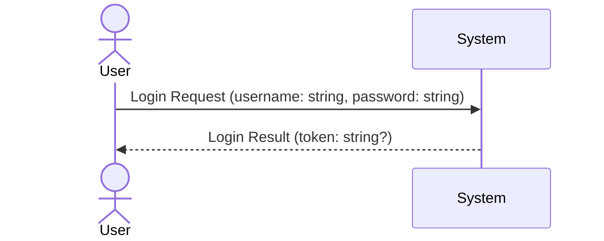

# System Sequence Diagram (SSD)

## Metadata
| **ID**      | **Description**                                                       | Cross Reference links                       |
|-------------|-----------------------------------------------------------------------|---------------------------------------------|
| UC-001-SSD  | System Sequence Diagram for Application user authentication use case  | [UC-001-B]                                  |

## Version
**Version:** 1.0  
**Reviewed/Approved:** 2026-01-24

## Version Log
| **Version** | **Date**       | **Author**      | **Change Description**                      |  
|-------------|----------------|-----------------|---------------------------------------------|
| 1.0         | 2026-01-24     | TirsvadCLI      | Initial creation of the system sequence diagram. |

---

## Diagram

<!-- Links -->
[UC-001-B]: ../UC-001/BehaviorModel.md "Brief Use Case for UC-001"
